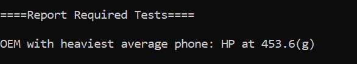
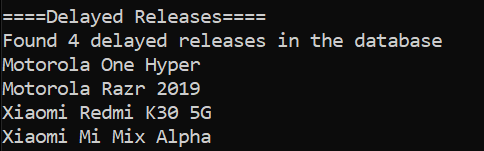
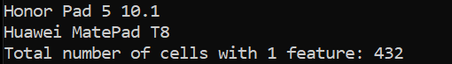
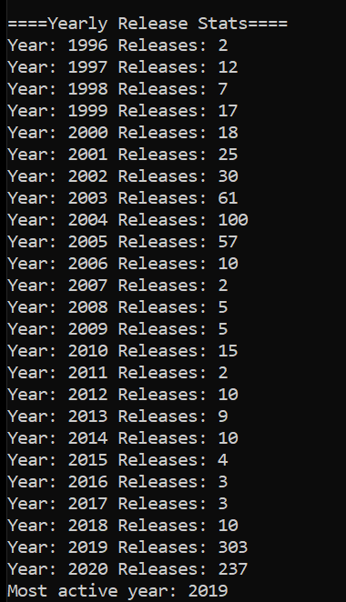

# CSB310_AlternativeLanguageProject

## Which programming language and version did you pick?
    
For this project I chose C# version 11(I think)

## Why did you pick this programming language?
    
Our team is writing our next wiki about C# so I wanted to exercise the language while learning about it. I had used C# in the past while working with Unity and some other desktop apps but it has been a few years and I've found myself more comfortable with Java and Python since then.

## How your programming language chosen handles: object-oriented programming, file ingestion, conditional statements, assignment statements, loops, subprograms (functions/methods), unit testing and exception handling. If one or more of these are not supported by your programming language, indicate it as so.
    
C# supports all of the above. I attempted to get formal unit tests into the solution but I kept encountering an issue with the alternative language project references not being picked up by the unit test project. I investigated causes and it seems like there's a mismatch in .NET framework between the project and the unit tests. I was not able to set the target .NET framework for the unit tests to match the prod project so I will have to keep looking around for a fix.

## List out 3 libraries you used from your programming language (if applicable) and explain what they are, why you chose them and what you used them for.
    
This project does not use many libraries. It looks like I'm only using ```System``` and ```Microsoft.VisualBasic```

## Answer the following questions (and provide a corresponding screen showing output answering them):

### What company (oem) has the highest average weight of the phone body?
OEM with the highest average weight was HP. Probably because it only has 1 entry and it's a larger device (453.6g)


### Was there any phones that were announced in one year and released in another? What are they? Give me the oem and models.
It looks like there were 4 delayed release:


### How many phones have only one feature sensor?
432



### What year had the most phones launched in the 2000s? 
2019 with 303 releases

